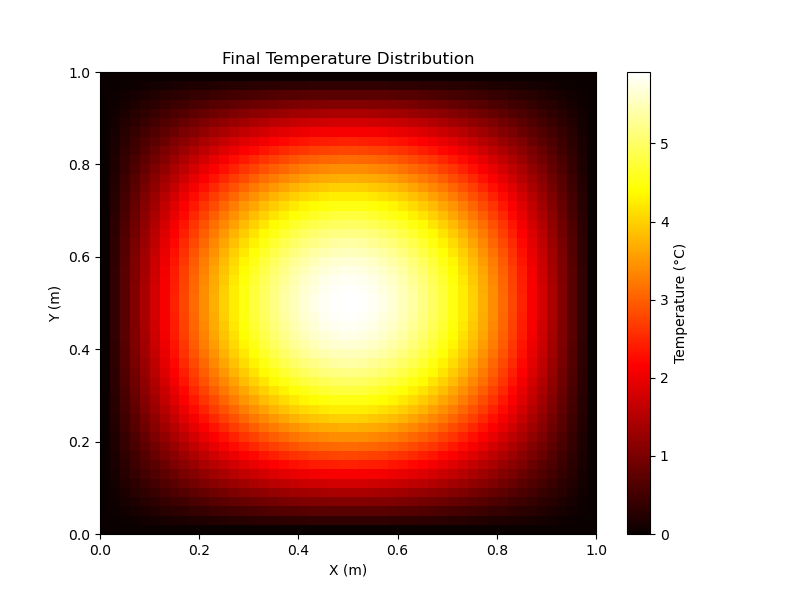

# Solving the 2D Heat Equation Using Finite Difference Method (FDM)

## Introduction
This project demonstrates solving the two-dimensional heat equation using the **finite difference method (FDM)**. The heat equation, a partial differential equation, is widely used in modeling **heat transfer**. This implementation includes the methodology, simulation results, and challenges encountered during development.

---

## Problem Description

The computational domain is initialized with uniform **boundary conditions**, and a **hot spot** is introduced at the center. The simulation evolves the **temperature distribution** over time.

---

## Numerical Method

The **finite difference method (FDM)** discretizes the heat equation. The spatial derivatives are approximated using **central differences**, and the time derivative is handled using **explicit forward differences**. 

## Implementation Details

### Code Structure
The implementation uses **Python** with modular functions:
- **Initialization:** Sets up spatial grid and initial conditions.
- **Boundary Conditions:** Applies Dirichlet boundary conditions.
- **Time Stepping Function:** Iterates the solution over time.
- **Visualization:** Generates plots and animations of the results.

### Dependencies
- **numpy:** Numerical computations.
- **matplotlib:** Visualization and animation.

### Boundary Conditions
Dirichlet boundary conditions are applied, maintaining constant temperatures of **zero** at domain edges.

### Stability Constraint
Stability is ensured by satisfying the **Courant-Friedrichs-Lewy (CFL)** condition:

## Results

### Simulation Outputs

### Animation
An animation of the temperature evolution highlights the **heat diffusion dynamics** and smoothing effects as temperature stabilizes.

---

## Discussion
The simulation effectively models **heat diffusion** in 2D, demonstrating heat dissipation from the central hot spot. The explicit FDM approach, while straightforward, imposes computational constraints due to stability requirements for **finer grids** or **longer simulations**.

---

## Conclusion
This project implements a **2D heat equation solver** using FDM, highlighting its utility for solving **partial differential equations (PDEs)**. Future work can explore **implicit methods** to overcome stability constraints and enable larger time steps.

---

## Code Documentation

### Structure and Modules
- **Initialization:** Sets up the spatial grid and initial conditions.
- **Boundary Conditions:** Enforces Dirichlet boundary conditions.
- **Time-Stepping Function:** Updates temperature distribution.
- **Visualization:** Generates plots and animations.

### Dependencies
- **numpy** - Numerical computations.
- **matplotlib** - Visualization.

---

## License
This project is licensed under the [MIT License](LICENSE).

---

## Contact
For any inquiries or contributions, feel free to reach out via GitHub Issues.

